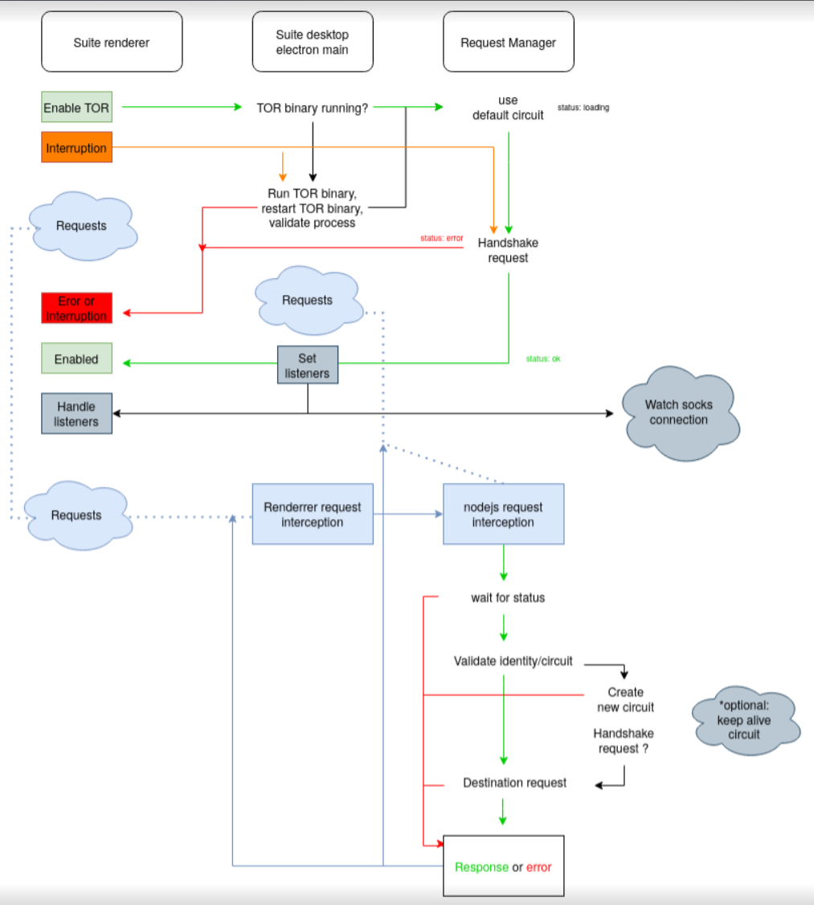

# Request manager

Library to allow efficient and stable proxy for requests using TOR or other similar systems.

## TODOs

- [ ] Reproduce the current issue
- [ ] Check that tor binary process is running
- [ ] Check that circuit is working (there is access to the internet throw TOR)
- [ ] We have request interceptor from renderer packages/suite-desktop/src-electron/libs/request-interceptor.ts
- [ ] Intercept the requests from the main process
- [ ] we can use the intercept request intercept in main process to log all the requests and make sure there is no uncontrol requests from suite

## Useful tips/links

* Where TOR is initialized -> packages/suite-desktop/src-electron/libs/processes/TorProcess.ts
* Current proxy -> packages/suite-desktop/src-electron/modules/trezor-connect-ipc.ts

## Propossed architecture

